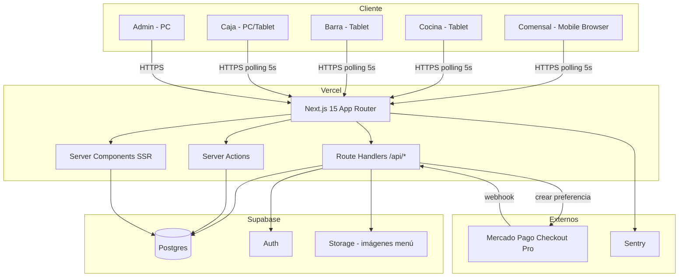
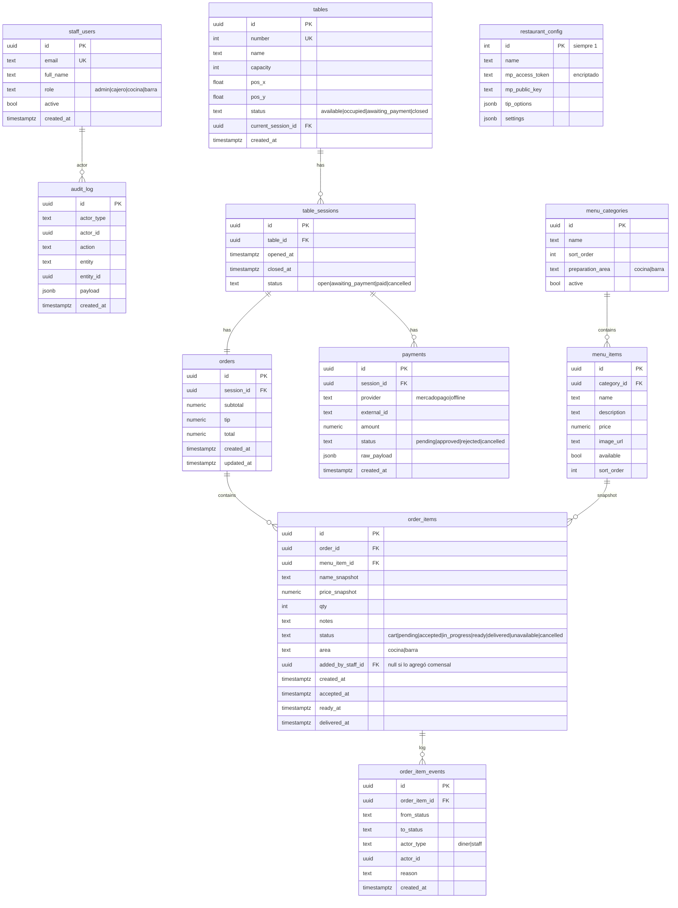

# PRD — MesaQR (MVP)

**Producto:** Web app de pedidos en mesa para bar/restaurante, con QR por mesa, vistas para cocina, barra y caja, y pago con Mercado Pago Checkout Pro.
**Cliente:** Producto académico/interno de **beWeb**.
**Versión del documento:** 1.1 (MVP, sin realtime)
**Idioma:** Español (Argentina)
**Autor:** Equipo beWeb

---

## 1. Resumen ejecutivo

MesaQR permite que los comensales de un restaurante escaneen un QR pegado en su mesa, vean el menú desde su celular, armen un pedido de forma colaborativa entre varios dispositivos, lo envíen a cocina y barra, y al finalizar paguen online con Mercado Pago. El staff del restaurante (cocina, barra, caja, admin) opera la app desde tablets o PCs, con sincronización por polling entre todas las vistas.

El MVP es **single-tenant, single-sucursal**, sin facturación electrónica, sin pagos parciales, sin variantes de producto, sin impresión de comandas y **sin realtime** (se usa polling). El foco es validar el flujo end-to-end con un equipo nuevo aprendiendo el stack.

---

## 2. Objetivos del MVP

### Objetivos de producto
1. Que un comensal pueda escanear un QR, ver el menú y enviar un pedido sin instalar nada ni registrarse.
2. Que varios comensales en la misma mesa puedan armar el pedido colaborativamente y verlo sincronizado con un delay máximo de unos pocos segundos.
3. Que cocina y barra reciban automáticamente lo que les corresponde y puedan gestionar el estado de cada ítem.
4. Que el cajero pueda supervisar todas las mesas, modificar pedidos y cerrar la cuenta.
5. Que el comensal pueda pagar la cuenta con Mercado Pago desde el mismo celular.

### Objetivos técnicos / aprendizaje
1. Que el equipo se familiarice con Next.js App Router, TypeScript estricto y Supabase.
2. Que la app esté lista para evolucionar a multi-tenant y a realtime en una v2 sin reescribir la base.
3. Mantener el costo del MVP en cero (free tier de Vercel + Supabase).

### Fuera de alcance del MVP (queda en TODO post-MVP)
- **Realtime / WebSockets** (en MVP usamos polling).
- Multi-tenant / multi-sucursal.
- Facturación electrónica AFIP/ARCA.
- Impresión de comandas en impresora térmica.
- Pagos parciales / dividir cuenta.
- Variantes y modificadores de productos con costo extra.
- Stock y horarios de menú.
- Múltiples idiomas.
- App offline-first.
- Reservas de mesa.
- Programa de fidelidad / cupones.
- Rol mozo con su propia vista.

---

## 3. Roles y permisos

| Rol | Acceso | Capacidades principales |
|---|---|---|
| **Comensal** | Anónimo, vía QR | Ver menú, agregar/quitar ítems al pedido, confirmar pedido, ver estado, pagar |
| **Admin** | Login email/password | Todo: gestión de menú, mesas, usuarios staff, configuración, reportes |
| **Cajero** | Login email/password | Ver todas las mesas, abrir/modificar pedidos, cobrar, cerrar mesa, resetear mesa |
| **Cocina** | Login email/password | Ver cola de ítems del área "cocina", cambiar estado |
| **Barra** | Login email/password | Ver cola de ítems del área "barra", cambiar estado, ver listos para llevar |

---

## 4. Flujos funcionales

### 4.1 Flujo del comensal

1. **Escanea el QR** pegado en la mesa. Se abre la URL `https://mesaqr.app/t/{tableId}` (UUID estable, no se rota).
2. La app valida la mesa y verifica que esté en estado `disponible` u `ocupada`. Si estaba `disponible`, **se abre una nueva sesión de mesa** automáticamente.
3. El comensal recibe una **cookie de sesión de comensal** (JWT firmado) ligada a la `session_id` de la mesa. No requiere login ni dato personal.
4. Ve el **menú** organizado por categorías, con foto, nombre, descripción y precio.
5. Toca un ítem → modal con cantidad y campo de "aclaraciones" (texto libre, opcional) → "Agregar al pedido".
6. La pantalla del comensal **hace polling cada 5 segundos** al endpoint de su orden para detectar cambios (ítems agregados por su acompañante, cambios de estado por cocina, etc.). Hay un botón "↻ Actualizar" visible para forzar refresco manual.
7. Cuando todos están de acuerdo, uno cualquiera toca **"Confirmar pedido"**. Los ítems pasan de estado `cart` a `pending` y son enviados a cocina/barra según corresponda.
8. Después de confirmar, puede **seguir agregando** más ítems en una nueva tanda (mismo flujo). Los ítems ya `accepted` por cocina aparecen bloqueados con leyenda *"Para modificar, hablá con el cajero"*.
9. En cualquier momento ve el **estado de cada ítem** (pendiente, en preparación, listo, entregado) y el subtotal acumulado.
10. Al final, puede tocar **"Pedir la cuenta"**, que avisa al cajero (lo verá en su próximo poll). El cajero **cierra la mesa**, y al recargar el QR el comensal ve la pantalla de pago con: detalle, propina configurable (0%, 10%, 15%, otro), total, y botón **"Pagar con Mercado Pago"**.
11. Tras el pago exitoso, ve un **comprobante en pantalla** (no es factura legal) y la sesión queda cerrada. El comensal ya no puede volver a operar con ese token.

> **Nota sobre colaboración multi-dispositivo:** el delay máximo de sincronización es ~5 segundos. Si dos comensales agregan ítems "en simultáneo", ambos se persisten correctamente (cada `POST` es atómico) y el segundo en hacer poll los ve todos.

### 4.2 Flujo de cocina

1. Login con email/password.
2. Pantalla única tipo *kanban horizontal* o lista, con tres columnas/secciones: **Pendientes**, **En preparación**, **Listos**.
3. Cada tarjeta es **un ítem individual** (no muestra mesa, no muestra precio): nombre del ítem, cantidad, aclaraciones, hora de pedido, tiempo transcurrido.
4. La pantalla **hace polling cada 5 segundos** al endpoint de la cola de cocina. Botón "↻ Actualizar" visible.
5. Acciones por tarjeta:
   - **Tomar** (pasa a `in_progress`)
   - **Marcar listo** (pasa a `ready`)
   - **No disponible** (con motivo opcional, pasa a `unavailable` y notifica al cajero en su próximo poll)
6. Solo ve ítems cuya `area = 'cocina'`.
7. Ordenamiento por defecto: más antiguo primero.
8. Cuando aparece un ítem nuevo en el poll, sonido sutil opcional (configurable, off por default).

### 4.3 Flujo de barra

Idéntico al de cocina pero filtrado por `area = 'barra'`. Además, tiene una **segunda vista** ("Para llevar") que lista ítems en estado `ready` con la **mesa de destino** visible, para que el barman/runner sepa adónde llevarlos. Al entregar, toca "Entregado" y pasa a `delivered`.

> **Nota:** Cocina también tiene esta vista "Para llevar" para sus propios ítems en MVP. Puede haber un futuro rol "runner" que centralice esto.

### 4.4 Flujo de caja

1. Login.
2. Pantalla principal: **layout visual del salón** con todas las mesas y su estado por color:
   - 🟢 Verde: disponible
   - 🟡 Amarillo: ocupada sin pedido confirmado
   - 🔵 Azul: con pedido en curso
   - 🟣 Violeta: pidió la cuenta
   - 🔴 Rojo: cerrada esperando pago / esperando reseteo
3. Polling cada 5 segundos al listado de mesas + estados. Botón "↻ Actualizar".
4. Click en una mesa → drawer con detalle:
   - Lista completa de ítems con estado, precio, aclaraciones
   - Botones para **agregar ítem manualmente** (en nombre del comensal) y **modificar/eliminar ítems** (incluso los `accepted`, con confirmación y motivo, queda en audit log)
   - Botón **"Cerrar mesa"** → genera el detalle final, marca la sesión como `awaiting_payment` y dispara la pantalla de pago para el comensal
   - Botón **"Marcar pagado en efectivo / offline"** (si el cliente paga afuera del flujo MP)
   - Botón **"Resetear mesa"** (solo disponible cuando el pago está confirmado o se marcó como offline) → cierra la sesión, vuelve la mesa a `disponible`
5. Indicador visual de notificaciones nuevas (mesa cerrada, pidieron cuenta, ítem no disponible) detectadas en el poll.

### 4.5 Flujo de admin

1. **Dashboard:** ventas del día, mesas activas, ticket promedio, ítems más vendidos (últimos 7 días).
2. **Gestión de menú:**
   - Categorías (CRUD, orden, área de preparación: cocina/barra)
   - Ítems (CRUD, foto subida a Supabase Storage, precio, descripción, disponibilidad on/off)
3. **Gestión de mesas:**
   - CRUD de mesas (número, nombre, capacidad)
   - Editor visual del salón (drag & drop sobre un canvas, guarda coordenadas x/y de cada mesa)
   - Generación e impresión de QRs (PDF descargable con todos los QRs)
4. **Gestión de usuarios staff:** CRUD con rol.
5. **Configuración:** datos del restaurante, credenciales Mercado Pago (access token, public key), porcentajes de propina sugeridos, sonidos de cocina/barra.
6. **Reportes (3 reportes simples en MVP):**
   - Ventas por día (rango configurable)
   - Productos más vendidos (rango configurable)
   - Tiempo promedio de preparación por categoría

---

## 5. Stack técnico

### 5.1 Decisión y justificación

| Capa | Tecnología | Por qué |
|---|---|---|
| **Framework full-stack** | Next.js 15 (App Router) + TypeScript | Nativo de Vercel free tier, SSR, route handlers, server actions, una sola codebase para front y back |
| **Base de datos** | Supabase Postgres | Postgres administrado gratis, escalable, vive fuera de Vercel, free tier generoso |
| **Auth staff** | Supabase Auth (email/password) | Integrado, JWT estándar, fácil de usar |
| **Auth comensal** | JWT firmado custom (jose) | Token de sesión firmado server-side, sin login real, sin Supabase Auth para no inflar usuarios |
| **Storage de imágenes** | Supabase Storage | Bucket público para fotos de menú, free tier 1GB |
| **UI** | Tailwind CSS + shadcn/ui + Lucide icons | Stack estándar, copy-paste de componentes, control total |
| **State client** | Zustand (carrito local) + React Query (server state + polling) | Liviano, simple para un equipo nuevo. React Query maneja polling/revalidation de forma declarativa |
| **Validación** | Zod | En route handlers y formularios, comparte tipos con TypeScript |
| **Pagos** | Mercado Pago SDK Node oficial (`mercadopago`) | Checkout Pro vía preferencia + webhook |
| **Generación de QRs** | `qrcode` (Node) + `react-pdf` para el PDF imprimible | Sin dependencias raras |
| **Hosting** | Vercel (free tier) | Cero costo en MVP, integración nativa con Next.js |
| **Observabilidad** | Vercel Analytics + Supabase logs + Sentry free tier | Suficiente para MVP |

### 5.2 ¿Por qué NO usar?

- **Supabase Realtime / Socket.IO / WebSockets propios:** se decidió postergarlo a v2. Polling cada 5s alcanza para el caso de uso, es más simple de debuggear y no requiere RLS especiales.
- **Prisma:** agrega complejidad y peso. Para MVP, el cliente Supabase + tipos generados desde Postgres alcanzan.
- **NestJS:** overkill para el tamaño del MVP y el equipo nuevo.
- **Redis / BullMQ:** no hay procesos asincrónicos de larga duración en MVP. El webhook de MP responde y termina.

### 5.3 Estrategia de polling

- **Librería:** React Query (`@tanstack/react-query`) en todas las pantallas que necesitan datos vivos.
- **Intervalo por defecto:** 5 segundos.
- **Optimizaciones:**
  - `refetchOnWindowFocus: true` para refrescar al volver a la pestaña.
  - Pausar polling cuando la pestaña está oculta (`document.hidden`).
  - Botón manual "↻ Actualizar" en cada pantalla.
  - En la pantalla del comensal, pausar polling cuando no hay sesión activa.
- **Costo estimado:** una mesa con 4 comensales activos hace ~48 requests/min al endpoint de orden. Para 20 mesas simultáneas son ~960 req/min, totalmente manejable en el free tier.
- **Endpoints idempotentes:** los GETs devuelven el estado completo, no diffs. Simple, predecible, sin estado intermedio.

### 5.4 Versiones objetivo

- Node.js 20 LTS
- Next.js 15.x
- React 19.x
- TypeScript 5.x estricto (`strict: true`, `noUncheckedIndexedAccess: true`)
- Supabase JS v2
- React Query v5

---

## 6. Arquitectura



**Flujo clave:** todos los clientes hablan **solo con Next.js** vía HTTPS. Next.js es la única capa que toca Supabase (con `service_role_key` server-side o cliente autenticado server-side). El cliente browser **nunca** se conecta directamente a Supabase. Esto simplifica RLS y la lógica de autorización vive centralizada en route handlers.

---

## 7. Modelo de datos

### 7.1 ERD



### 7.2 Notas de diseño

- **`name_snapshot` y `price_snapshot` en `order_items`:** congelan el nombre y precio al momento de pedirlo. Si el admin cambia el precio del menú, los pedidos viejos no se alteran.
- **URL del QR físico = `/t/{tableId}`** con UUID estable. La sesión del comensal se gestiona vía cookie JWT, no vía token rotativo en la URL. **El QR físico no necesita reimprimirse al resetear la mesa.**
- **`order_item_events`:** queda toda la trazabilidad del ítem para reportes de tiempos y disputas.
- **`restaurant_config`:** una sola fila. Patrón "singleton table" preparado para multi-tenant futuro.
- **Multi-tenant futuro:** todas las tablas tendrán que sumar `restaurant_id`. Diseñar las queries asumiendo que ese filtro va a venir, aunque en MVP no esté.

### 7.3 Row Level Security (RLS)

Sin acceso directo del browser a Supabase, RLS es una **segunda capa de defensa**, no la primaria. Estrategia:

- **Activar RLS en todas las tablas** (default-deny).
- **Usar `service_role_key`** desde route handlers de Next.js para bypassear RLS, porque la autorización se valida en código antes de cada query.
- **Lectura pública** solo para `menu_categories.active = true` y `menu_items.available = true` (por si en algún momento queremos exponer un menú público sin pasar por la app).
- **Toda escritura** pasa por route handlers que validan rol/sesión, y usan `service_role_key`.

Ventajas: la lógica de autorización vive en un solo lugar (route handlers), es trivial de testear, y RLS queda como red de seguridad por si alguna vez se filtra una `anon_key`.

---

## 8. API endpoints

Todos los endpoints son **route handlers de Next.js** bajo `/app/api/*`. Devuelven JSON. Validan input con Zod. Errores con formato `{ error: { code, message } }`.

### 8.1 Comensal (auth: JWT de mesa en cookie)

| Método | Path | Descripción |
|---|---|---|
| `POST` | `/api/diner/session` | Body: `{ tableId }`. Si la mesa está disponible, abre sesión y devuelve cookie JWT con `session_id`. Si ya está ocupada, se suma a la sesión existente |
| `GET` | `/api/diner/menu` | Devuelve menú completo (categorías + ítems disponibles) |
| `GET` | `/api/diner/order` | **Endpoint de polling.** Devuelve la orden actual de la sesión con todos sus ítems y estados. Soporta `ETag` |
| `POST` | `/api/diner/order/items` | Agrega ítem al carrito. Body: `{ menuItemId, qty, notes }` |
| `PATCH` | `/api/diner/order/items/:id` | Modifica qty/notes. Solo si status = `cart` |
| `DELETE` | `/api/diner/order/items/:id` | Elimina del carrito. Solo si status = `cart` |
| `POST` | `/api/diner/order/confirm` | Pasa todos los ítems `cart` a `pending` y los envía a cocina/barra |
| `POST` | `/api/diner/order/request-bill` | Marca la sesión como "pidió la cuenta" |
| `POST` | `/api/diner/payment/checkout` | Body: `{ tip }`. Crea preferencia de Mercado Pago, devuelve `init_point` |
| `GET` | `/api/diner/payment/status` | Consulta el estado del pago de la sesión actual |

### 8.2 Staff (auth: Supabase Auth)

| Método | Path | Rol | Descripción |
|---|---|---|---|
| `GET` | `/api/staff/tables` | cajero/admin | **Polling.** Lista todas las mesas con estado |
| `GET` | `/api/staff/tables/:id` | cajero/admin | **Polling.** Detalle de mesa con sesión y orden |
| `POST` | `/api/staff/tables/:id/items` | cajero/admin | Agrega ítem manualmente |
| `PATCH` | `/api/staff/orders/items/:id` | cajero/admin | Modifica/elimina ítem (incluso `accepted`, con `reason`) |
| `POST` | `/api/staff/tables/:id/close` | cajero/admin | Cierra la mesa, calcula total, pasa a `awaiting_payment` |
| `POST` | `/api/staff/tables/:id/mark-paid-offline` | cajero/admin | Marca pago manual |
| `POST` | `/api/staff/tables/:id/reset` | cajero/admin | Cierra sesión y libera mesa |
| `GET` | `/api/staff/kitchen/items` | cocina/admin | **Polling.** Cola de cocina (filtrada por área) |
| `GET` | `/api/staff/bar/items` | barra/admin | **Polling.** Cola de barra |
| `PATCH` | `/api/staff/items/:id/status` | cocina/barra/admin | Cambia estado del ítem |
| `GET` | `/api/staff/admin/menu/*` | admin | CRUD menú |
| `GET` | `/api/staff/admin/tables/*` | admin | CRUD mesas + layout |
| `GET` | `/api/staff/admin/users/*` | admin | CRUD staff users |
| `GET` | `/api/staff/admin/config` | admin | Lee/edita config |
| `GET` | `/api/staff/admin/reports/*` | admin | Reportes |

### 8.3 Webhooks

| Método | Path | Descripción |
|---|---|---|
| `POST` | `/api/webhooks/mercadopago` | Recibe notificación de MP, valida firma, actualiza `payments` y dispara cierre de sesión |

### 8.4 Optimización de polling

Los endpoints marcados como **"Polling"** soportan ETag/If-None-Match: el endpoint devuelve un header `ETag` calculado sobre el estado serializado. El cliente envía `If-None-Match` en el siguiente poll; si nada cambió, el server devuelve `304 Not Modified` con body vacío. React Query lo soporta.

---

## 9. Estrategia de sincronización (polling)

### 9.1 Pantallas con polling activo

| Pantalla | Endpoint | Intervalo | Notas |
|---|---|---|---|
| Comensal — pedido | `GET /api/diner/order` | 5s | Pausa con tab oculta |
| Cocina | `GET /api/staff/kitchen/items` | 5s | Sonido opcional al detectar nuevos |
| Barra | `GET /api/staff/bar/items` | 5s | Sonido opcional al detectar nuevos |
| Caja — listado mesas | `GET /api/staff/tables` | 5s | Resaltar visualmente cambios |
| Caja — detalle mesa | `GET /api/staff/tables/:id` | 5s | Solo cuando el drawer está abierto |

### 9.2 Pantallas sin polling

- Menú del comensal (estático, no cambia durante la sesión).
- Pantalla de pago.
- Comprobante.
- Todo el panel admin (CRUDs, reportes, configuración).

### 9.3 Patrón con React Query

```ts
const { data, refetch } = useQuery({
  queryKey: ['kitchen-items'],
  queryFn: () => fetch('/api/staff/kitchen/items').then(r => r.json()),
  refetchInterval: 5000,
  refetchIntervalInBackground: false, // pausa con tab oculta
  refetchOnWindowFocus: true,
});
```

### 9.4 Migración futura a realtime

Cuando se quiera migrar a realtime (post-MVP):
- Reemplazar `refetchInterval` por suscripción a Supabase Realtime.
- Los endpoints de polling pueden quedar como están: Realtime solo dispara invalidaciones de cache de React Query.
- No requiere cambios en el modelo de datos.

---

## 10. Integración Mercado Pago

### 10.1 Configuración

- El admin carga `access_token` y `public_key` en la pantalla de configuración.
- Se guardan en `restaurant_config` **encriptados** con una key del entorno (`CONFIG_ENCRYPTION_KEY`).

### 10.2 Flujo de pago

1. Comensal toca "Pagar con Mercado Pago" eligiendo propina.
2. Front llama a `POST /api/diner/payment/checkout` con `{ tip }`.
3. Server:
   - Valida que la sesión esté en `awaiting_payment`.
   - Recalcula el total real desde la DB (no confía en el cliente).
   - Crea una **preferencia** en MP con un único item "Consumo Mesa N° X" por el total final.
   - Configura `external_reference = session_id` y `notification_url = https://.../api/webhooks/mercadopago`.
   - Persiste un registro `payments` en estado `pending`.
   - Devuelve `init_point` (o `sandbox_init_point` en dev).
4. El front redirige al `init_point` (Checkout Pro hosted).
5. MP procesa el pago y llama al webhook.
6. Webhook valida firma (`x-signature` header), consulta `payment` en MP via SDK, actualiza el registro local. Si `approved`, marca la sesión como `paid` y la mesa queda lista para reseteo.
7. El comensal vuelve a la URL de retorno (`back_urls.success`) y ve el comprobante. La pantalla del cajero se entera en su próximo poll.

### 10.3 Estados de pago

`pending` → `approved` | `rejected` | `cancelled`. Si el pago falla, la mesa vuelve a `awaiting_payment` y el comensal puede reintentar.

### 10.4 Modo offline

Si el cajero marca pago offline, se crea un `payments` con `provider = 'offline'`, `status = 'approved'` directamente, y la sesión pasa a `paid`.

---

## 11. Seguridad

### 11.1 Autenticación

- **Staff:** Supabase Auth (email + password). Sesión via cookies httpOnly gestionadas por `@supabase/ssr`.
- **Comensal:** JWT firmado con `jose`, payload `{ session_id, table_id, iat, exp }`, cookie httpOnly `mesaqr_diner`. Expira con la sesión de la mesa o a las 6 horas.

### 11.2 Autorización

- Middleware de Next.js que valida rol en cada `/api/staff/*`.
- En `/api/diner/*`, middleware verifica el JWT y carga `session_id` al contexto.
- Toda mutación recalcula totales server-side; el cliente nunca decide el precio.
- Acceso a Supabase desde server-side con `service_role_key`. RLS activada como red de seguridad.

### 11.3 Validación

- **Zod** en cada route handler, tanto body como params.
- Sanitización de `notes` (texto libre del comensal): trim, max 200 chars, escape al renderizar.

### 11.4 Token de mesa

- URL pública del QR: `/t/{tableId}` (UUID estable).
- Al primer escaneo, el server crea/recupera la sesión y emite el JWT.
- Cuando el cajero resetea la mesa, la sesión vieja se cierra; el próximo escaneo abre una nueva. **El QR físico no necesita reimprimirse.**

### 11.5 Anti-abuso

- Rate limiting en endpoints de comensal con `@upstash/ratelimit` (free tier) o middleware simple en memoria. Límites sugeridos: 60 req/min por IP para mutaciones, 120 req/min por sesión para los GET de polling (un poll cada 5s = 12/min, hay margen).
- Validación que la mesa exista y esté activa antes de abrir sesión.

### 11.6 Datos sensibles

- `mp_access_token` encriptado con AES-256-GCM en DB.
- Variables de entorno en Vercel para keys de Supabase (service role, anon), MP webhook secret, encryption key, JWT secret de comensal.
- Logs nunca imprimen tokens completos.

### 11.7 Webhook

- Validación de firma de MP (`x-signature` con HMAC).
- Idempotencia: si el `external_id` ya está procesado, se ignora.

### 11.8 Auditoría

- Toda modificación de pedidos por staff sobre ítems `accepted` queda en `audit_log` y `order_item_events`.

---

## 12. Wireframes / Flujos de pantalla (descritos)

### 12.1 Comensal — Mobile

1. **`/t/{tableId}` — Bienvenida + Menú**
   - Header sticky: nombre del restaurante, número de mesa, botón "Mi pedido (n)" con badge.
   - Tabs horizontales con categorías.
   - Cards verticales con foto, nombre, precio, botón "+".
   - Footer fijo: total acumulado del carrito + botón grande "Ver pedido".

2. **Modal "Agregar ítem"**
   - Foto, nombre, descripción, precio.
   - Selector de cantidad.
   - Textarea "Aclaraciones (opcional)".
   - Botón "Agregar al pedido".

3. **`/t/{tableId}/order` — Mi pedido (compartido con la mesa)**
   - Lista de ítems con estado visual (badge color + texto).
   - Ítems en `cart` editables (qty, eliminar).
   - Ítems ya enviados con badge "En cocina" / "Listo" / etc., bloqueados, con leyenda "Para modificar, hablá con el cajero".
   - Subtotal, total.
   - Botón "Confirmar pedido" (visible si hay ítems en `cart`).
   - Botón secundario "Pedir la cuenta".
   - Indicador discreto "Actualizado hace Xs" + botón "↻".

4. **`/t/{tableId}/pay` — Pagar (cuando la sesión está `awaiting_payment`)**
   - Detalle final.
   - Selector de propina (chips: 0% / 10% / 15% / Otro).
   - Total final.
   - Botón "Pagar con Mercado Pago".

5. **`/t/{tableId}/done` — Comprobante**
   - "¡Gracias!" + resumen + ID de transacción.
   - La sesión queda cerrada.

### 12.2 Cocina / Barra — Tablet

- **Login** en `/staff/login`.
- **`/staff/kitchen`** o **`/staff/bar`**:
  - Header con nombre, hora, contador de ítems pendientes, indicador "Actualizado hace Xs" + botón "↻".
  - 3 columnas (kanban): **Pendientes**, **En preparación**, **Listos**.
  - Cards grandes con: nombre, qty, aclaraciones, hora pedido, tiempo transcurrido (en minutos), botones de acción.
  - Sonido opcional al entrar nuevo ítem.
- **`/staff/bar/runner`** (vista para llevar):
  - Lista plana de ítems `ready`, agrupados por mesa.
  - Botón "Entregado" por ítem.

### 12.3 Caja — PC/Tablet

- **`/staff/cashier`**:
  - Layout visual del salón (mesas como cuadrados/círculos posicionados).
  - Click en mesa → drawer lateral con detalle.
  - Botones: agregar ítem, editar/eliminar ítem, cerrar mesa, marcar pagado offline, resetear mesa.
  - Indicador "Actualizado hace Xs" + botón "↻".

### 12.4 Admin — PC

- **`/staff/admin`**: dashboard con KPIs.
- **`/staff/admin/menu`**: lista de categorías + ítems, modal de edición, drag para reordenar, upload de imagen.
- **`/staff/admin/tables`**: editor visual del salón con drag & drop, panel lateral con CRUD.
- **`/staff/admin/qrs`**: botón "Generar PDF de QRs" → descarga PDF imprimible (un QR por hoja A4 con número de mesa grande).
- **`/staff/admin/users`**: tabla CRUD.
- **`/staff/admin/config`**: formulario.
- **`/staff/admin/reports`**: 3 reportes con date pickers.

---

## 13. Plan de fases

### Fase 0 — Setup (semana 1)
- Repo, Next.js, TypeScript estricto, Tailwind, shadcn/ui.
- Proyecto Supabase, esquema DB con migraciones (`supabase/migrations/*.sql`).
- Auth de staff básico con Supabase Auth.
- Deploy a Vercel + variables de entorno.
- CI básico (lint + typecheck).

### Fase 1 — Backbone admin (semana 2)
- CRUD de menú (categorías, ítems, upload imágenes a Supabase Storage).
- CRUD de mesas (sin layout visual, solo lista).
- CRUD de usuarios staff.
- Configuración del restaurante (sin MP todavía).

### Fase 2 — Flujo comensal core (semana 3)
- `/t/{tableId}` con apertura de sesión y JWT.
- Vista de menú.
- Carrito con persistencia en DB (estado `cart`).
- Confirmar pedido → estado `pending`.
- React Query con polling 5s en `/api/diner/order`.

### Fase 3 — Cocina y barra (semana 4)
- Vistas kanban con cambios de estado.
- Polling 5s.
- Ruteo automático cocina/barra por categoría.
- Vista runner.

### Fase 4 — Caja (semana 5)
- Lista de mesas con estados + polling.
- Detalle, modificación, cierre.
- Layout visual del salón (admin + caja).

### Fase 5 — Pagos (semana 6)
- Integración Checkout Pro.
- Webhook + validación firma.
- Modo offline.
- Pantalla de comprobante.

### Fase 6 — Reportes y pulido (semana 7)
- 3 reportes en admin.
- Dashboard con KPIs.
- QA end-to-end.
- Documentación de uso para staff.

> **Nota:** Sin estimaciones de horas. Las semanas son orientativas para ordenar el trabajo, no compromisos.

---

## 14. TODO post-MVP

- [ ] **Migrar polling a Supabase Realtime** (subscripciones a `order_items`, `tables`, `table_sessions`).
- [ ] Multi-tenant (sumar `restaurant_id` a todas las tablas, subdominios).
- [ ] Multi-sucursal.
- [ ] Impresión de comandas en impresora térmica (red local + ESC/POS).
- [ ] Facturación electrónica AFIP/ARCA.
- [ ] Pagos parciales y dividir cuenta.
- [ ] Variantes y modificadores de productos con costo extra.
- [ ] Stock por ítem.
- [ ] Horarios de menú (menú del día, mediodía/noche).
- [ ] Multi-idioma (es/en/pt).
- [ ] PWA offline-first para staff.
- [ ] Reservas de mesa.
- [ ] Programa de fidelidad / cupones.
- [ ] Rol mozo con su propia vista.
- [ ] Notificaciones push (web push) para staff.
- [ ] Mercado Pago Point (lector físico).
- [ ] Reportes avanzados (cohort, tiempo de mesa, eficiencia por mozo).
- [ ] Integración con Google Reviews post-pago.

---

## 15. Anexos

### 15.1 Variables de entorno

```env
# Supabase
NEXT_PUBLIC_SUPABASE_URL=
NEXT_PUBLIC_SUPABASE_ANON_KEY=
SUPABASE_SERVICE_ROLE_KEY=

# JWT comensal
DINER_JWT_SECRET=

# Encriptación de credenciales sensibles en DB
CONFIG_ENCRYPTION_KEY=

# Mercado Pago (webhook secret, el access token vive en DB)
MP_WEBHOOK_SECRET=

# App
NEXT_PUBLIC_APP_URL=https://mesaqr.vercel.app

# Sentry
SENTRY_DSN=
```

### 15.2 Estructura de carpetas propuesta

```
mesaqr/
├── app/
│   ├── (public)/
│   │   └── t/[tableId]/
│   │       ├── page.tsx              # menú
│   │       ├── order/page.tsx
│   │       ├── pay/page.tsx
│   │       └── done/page.tsx
│   ├── (staff)/
│   │   └── staff/
│   │       ├── login/page.tsx
│   │       ├── kitchen/page.tsx
│   │       ├── bar/page.tsx
│   │       ├── cashier/page.tsx
│   │       └── admin/
│   │           ├── page.tsx
│   │           ├── menu/...
│   │           ├── tables/...
│   │           ├── users/...
│   │           ├── config/page.tsx
│   │           └── reports/...
│   └── api/
│       ├── diner/...
│       ├── staff/...
│       └── webhooks/mercadopago/route.ts
├── components/
│   ├── ui/                # shadcn
│   ├── diner/
│   ├── kitchen/
│   ├── cashier/
│   └── admin/
├── lib/
│   ├── supabase/
│   │   ├── client.ts      # browser (solo para auth de staff)
│   │   ├── server.ts      # server components / route handlers
│   │   └── admin.ts       # service role (solo server)
│   ├── auth/
│   │   ├── diner-jwt.ts
│   │   └── staff.ts
│   ├── mercadopago/
│   ├── crypto.ts
│   └── validations/       # schemas zod
├── supabase/
│   └── migrations/
├── public/
├── middleware.ts
├── package.json
└── README.md
```

### 15.3 Glosario

- **Sesión de mesa:** período desde que el primer comensal escanea el QR hasta que el cajero resetea la mesa.
- **Orden:** una única orden por sesión, agrupa todos los ítems pedidos.
- **Ítem:** un renglón de la orden (un ítem del menú con qty y notes).
- **Área de preparación:** cocina o barra, definido a nivel categoría.
- **Tanda / ronda:** conjunto de ítems confirmados juntos. No es una entidad separada, queda implícito por timestamps.
- **Polling:** patrón donde el cliente consulta periódicamente al servidor por cambios. En MVP, intervalo de 5 segundos.

---

**Fin del PRD.**
